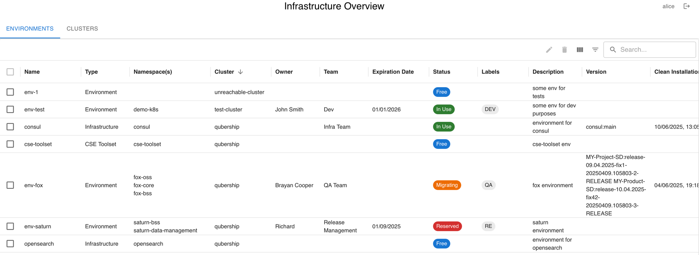
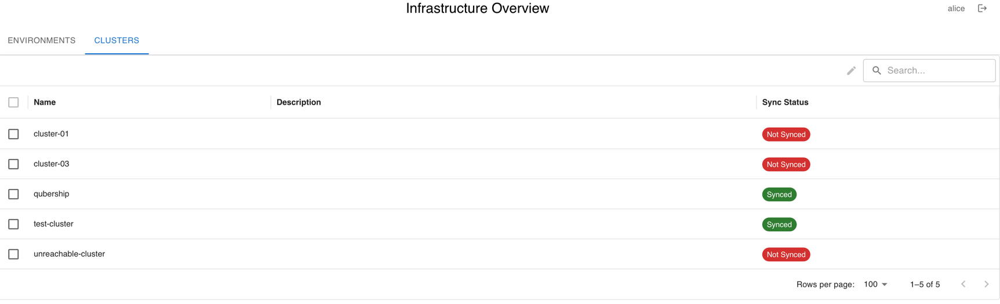

[](https://sonarcloud.io/summary/new_code?id=Netcracker_qubership-colly)
[](https://sonarcloud.io/summary/new_code?id=Netcracker_qubership-colly)

# Qubership Colly

A modern cluster environment tracking tool. Qubership Colly provides comprehensive visibility into Kubernetes environments across multiple clusters, helping teams track resource usage, manage environment lifecycles, and monitor common environment metrics.

## Features

- **Multi-cluster Support** - Monitor environments across multiple Kubernetes clusters
- **Cloud Passport Integration** - Native support for Cloud Passport configuration management
- **Environment Grouping** - Group multiple namespaces into logical environments
- **Environment Lifecycle Management** - Track environment creation, expiration, and cleanup
- **Rich Metadata Management** - Track owners, teams, descriptions, and custom labels for Environments
- **Deployment Version Tracking** - Monitor version information across environments
- **Monitoring Integration** - Collect and display metrics from Prometheus/monitoring systems
- **OIDC Authentication** - Secure access with Keycloak or other OIDC providers
- **Automated Discovery** - Scheduled synchronization with cluster resources
- Advanced filtering and search capabilities

## User Interface

### Environment Table

The main interface displays environments in a comprehensive table with the following columns:

- **Name** - Environment name from Cloud Passport configuration
- **Namespace(s)** - Associated Kubernetes namespaces
- **Type** - Environment type (ENVIRONMENT, INFRASTRUCTURE, CSE_TOOLSET, UNDEFINED) calculated from namespace labels (editable by admins)
- **Cluster** - Source cluster name
- **Owner** - Environment owner (editable by admins)
- **Team** - Associated team (editable by admins)
- **Expiration Date** - Environment expiration date for lifecycle management
- **Status** - Current status (IN_USE, FREE, MIGRATING, RESERVED) with color coding
- **Labels** - Custom labels as chips (editable by admins)
- **Description** - Environment description from Cloud Passport or manual entry
- **Version** - Deployment version information from config maps
- **Clean Installation Date** - Last clean installation timestamp from config maps
- **Monitoring Columns** - Dynamic columns for custom monitoring metrics

### Cluster Table


- View cluster synchronization status
- Monitor cluster connectivity
- Track cluster-specific configurations

### Administrative Features
- Edit environment metadata (type, owner, team, description, status, labels, expiration)
- Edit cluster metadata (description)
- Delete environments with confirmation

## Architecture Overview

Key Points:
- **Frontend**: React-based web interface with Material-UI components
- **Backend**: Quarkus-based REST API with PostgreSQL database
- **Scheduler**: Configurable cron jobs for cluster synchronization
- **Authentication**: OIDC integration for secure access control


## Quick Start

### Run with Docker
```bash
# Start PostgreSQL database
docker run -d --rm --name colly-db -p 5432:5432 \
  -e POSTGRES_USER=postgres -e POSTGRES_PASSWORD=postgres postgres:17

# Run Qubership Colly
docker run -v ~/.kube:/kubeconfigs \
  -e ENV_INSTANCES_REPO=https://github.com/ormig/cloud-passport-samples.git \
  -i --rm -p 8080:8080 ghcr.io/netcracker/qubership-colly:latest
```

### Deploy with Helm
```bash
# Add helm repository
helm repo add netcracker https://netcracker.github.io/helm-charts
helm repo update

# Install with basic configuration
helm install qubership-colly netcracker/qubership-colly \
  --set colly.db.password=<DB_PASSWORD> \
  --set colly.db.username=<DB_USERNAME> \
  --set colly.db.host=<DB_HOST> \
  --set colly.idp.url=http://<KEYCLOAK_HOST>:<PORT>/realms/colly-realm
```

## Configuration

For detailed configuration options including application properties, environment variables, Helm chart parameters, and deployment examples, see [docs/CONFIGURATION.md](docs/CONFIGURATION.md).

## Development

### Prerequisites
- Java 21+
- Node.js 18+
- PostgreSQL 12+
- Docker (optional)

### Build and Run
```bash
# Build the application
./mvnw clean package

# Run in development mode
./mvnw quarkus:dev

# Build frontend separately
cd src/main/webui
npm install
npm run build
```

### Testing
```bash
# Run all tests
./mvnw test

# Run with coverage
./mvnw test jacoco:report
```

## Contributing

1. Fork the repository
2. Create a feature branch
3. Make your changes
4. Add tests for new functionality
5. Submit a pull request

## License

This project is licensed under the Apache License 2.0 - see the LICENSE file for details.

## Support

For issues and questions:
- Create an issue in the GitHub repository
- Check the [Configuration Guide](docs/CONFIGURATION.md) for detailed setup instructions
- Review troubleshooting steps in the configuration documentation
